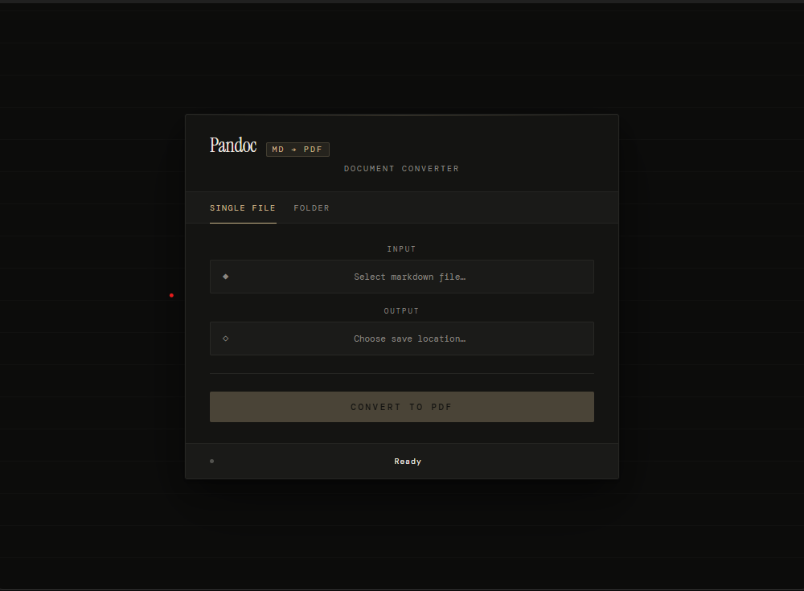

Here’s a clean, professional, and well-structured **README.md** file tailored for your Wails-based Markdown-to-PDF desktop app. You can copy-paste it directly into your project root as `README.md`.

```markdown
# Markdown2PDF

A simple, lightweight desktop application that converts Markdown files to beautiful PDFs.

Built with **Go** + **Wails** (Go backend + modern web frontend) for cross-platform support (Windows, macOS, Linux).


## Features

- Clean, minimal dark-themed UI
- Select any Markdown (.md) file
- Choose output PDF location
- One-click conversion using **Pandoc** (embedded)
- Table of contents generation
- Custom page margins (1 inch)
- Cross-platform: Windows, macOS, Linux

## Screenshots



## Tech Stack

- **Frontend**: React (or Vanilla JS/TS) + Tailwind / plain CSS
- **Backend**: Go + [Wails v2](https://wails.io/)
- **Conversion Engine**: Embedded [Pandoc](https://pandoc.org/) (standalone binary)
- **PDF Rendering**: Pandoc with `--pdf-engine=xelatex` (requires LaTeX installed) or alternatives like WeasyPrint

## Installation & Usage (for end users)

### Prerequisites (for PDF conversion to work properly)

- **Windows / macOS / Linux**: Install a LaTeX distribution for best results:
  - Windows: [MiKTeX](https://miktex.org/) or [TinyTeX](https://yihui.org/tinytex/)
  - macOS: [MacTeX](https://www.tug.org/mactex/) or TinyTeX
  - Linux: `sudo apt install texlive-xetex texlive-fonts-recommended` (Ubuntu/Debian)

  *Alternative (no LaTeX needed)*: Install [WeasyPrint](https://weasyprint.org/) via Python (`pip install weasyprint`) and change engine in code.

### Download Releases

Pre-built binaries coming soon!  
(Once released: check [Releases](https://github.com/yourusername/markdown2pdf/releases) page)

### Run from Source (Developers)

```bash
# 1. Clone the repo
git clone https://github.com/yourusername/markdown2pdf.git
cd markdown2pdf

# 2. Install Wails CLI (if not already installed)
go install github.com/wailsapp/wails/v2/cmd/wails@latest

# 3. Install frontend dependencies (if using npm/yarn)
cd frontend
npm install    # or yarn install / pnpm install
cd ..

# 4. Run in development mode
wails dev

# 5. Build for production
wails build
```

The built executable will be in `build/bin/`.

## Project Structure

```
markdown2pdf/
├── build/                  # Wails build artifacts + appicon.png
│   └── appicon.png
├── frontend/               # React / HTML / JS frontend
│   ├── src/
│   └── dist/               # built frontend assets
├── pandoc-bin/             # Embedded Pandoc binaries (windows/, darwin/, linux/)
├── converter/              # Go package for conversion logic
├── main.go                 # Wails entry point
├── wails.json              # Wails configuration
└── go.mod
```

## Planned Improvements

- Support more input formats (.docx, .html, .rst via Pandoc)
- Preview generated PDF inside the app
- Custom themes / CSS styling for PDF output
- Progress indicator during conversion
- Option to choose PDF engine (WeasyPrint, wkhtmltopdf, etc.)
- Auto-detect and warn about missing dependencies

## Contributing

Pull requests are welcome!  
For major changes, please open an issue first to discuss what you want to change.

1. Fork the repo
2. Create your feature branch (`git checkout -b feature/amazing-feature`)
3. Commit your changes (`git commit -m 'Add amazing feature'`)
4. Push to the branch (`git push origin feature/amazing-feature`)
5. Open a Pull Request

## License

MIT License  
See [LICENSE](LICENSE) for full text.

## Acknowledgments

- [Wails](https://wails.io/) – Amazing framework for Go + web desktop apps
- [Pandoc](https://pandoc.org/) – The universal document converter
- All the open-source tools that made this possible

Made with ❤️ in Delhi  
© 2026 Suraj (@SurajTechsmith)
```

### Quick Tips Before Committing

1. Replace placeholders:
   - GitHub repo URL: `https://github.com/SurajTechsmith/markdown2pdf`
   - Add real screenshots (take them with the app open)
   - Add actual LICENSE file if you want MIT (or choose another)

2. Add a screenshot:
   - Run the app
   - Take a clean screenshot (e.g. Snipping Tool on Windows, Cmd+Shift+4 on macOS)
   - Save as `docs/screenshot.png` or directly in root
   - Update the markdown link: ``

3. Optional sections you can add later:
   - Badges (Go version, Wails version, license)
   - Demo GIF/video
   - Build status (if using GitHub Actions)

This README is ready to impress users, potential contributors, and looks good on GitHub.  
Let me know if you want to add sections like "Troubleshooting" (e.g. "xelatex not found") or make it shorter/more minimal!